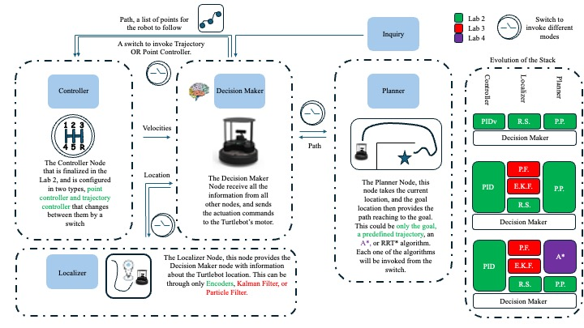

# ROS2 Autonomous Mobile Robot Navigation Stack

## Overview

This project implements a full autonomous mobile robotics pipeline using ROS2 and TurtleBot4, integrating perception, localization, planning, and control into a complete navigation system.

The system enables a robot to:
- Process real-time sensor data (IMU, LiDAR, odometry)
- Estimate its pose using particle filter localization
- Generate collision-free paths using A* planning
- Execute trajectories using closed-loop PID control

The final system is capable of autonomous navigation in a mapped environment, from goal selection to path execution.

## Acknowledgement

This project was developed as part of ME597 (Autonomous Mobile Robots) at the University of Waterloo in a team of four.

Each team member independently implemented modules across sensing, control, localization, and planning. The final system was constructed through collaborative review, testing, and selection of the most robust implementations.

This repository reflects a fully integrated navigation stack based on that validation-driven process.

## System Architecture

The navigation pipeline follows:

**Sensor Data → Localization → Planning → Control → Actuation**

- **Sensor Processing:** IMU, LiDAR, and odometry data are read through ROS2 topics
- **Localization:** A particle filter estimates robot pose using sensor data and a known map
- **Planning:** A* algorithm generates an optimal path using a cost/occupancy map
- **Control:** PID controller computes velocity commands to follow the planned trajectory
- **Execution:** Commands are published to the robot to achieve autonomous movement

## Sensor Data Processing

Implemented ROS2-based data acquisition and logging for:
- IMU data
- LiDAR scans
- Wheel encoder (odometry) data

Developed motion primitives (line, spiral, circle) and logged sensor outputs for analysis and validation.

## Closed-Loop Control

Implemented P, PI, PD, and PID controllers for trajectory tracking:
- Designed control laws for linear and angular motion
- Computed tracking error and error derivatives/integrals
- Applied actuator saturation limits
- Tuned gains based on performance metrics (accuracy, overshoot, response time)

Validated controller performance through trajectory tracking experiments.

## Localization (Particle Filter)

Implemented a particle filter for real-time robot localization:
- Developed motion models for particle propagation
- Constructed likelihood fields using occupancy maps
- Computed particle weights based on sensor measurements
- Performed resampling to improve state estimation

Integrated localization into the navigation loop and visualized results in RViz.

## Path Planning and Navigation

Implemented A* path planning and integrated it with the full system:
- Generated cost maps from occupancy grids
- Implemented A* search with Manhattan and Euclidean heuristics
- Produced waypoint trajectories for navigation
- Integrated planner with localization and control modules

Executed full autonomous navigation:
- Selected goal positions in RViz
- Generated collision-free paths
- Followed paths using closed-loop control
- Logged robot trajectory and performance

## Key Technologies

- **ROS2**
- **Python**
- **TurtleBot4**
- **RViz**
- **LiDAR / IMU / Odometry**
- **PID Control**
- **Particle Filter**
- **A* Path Planning**
