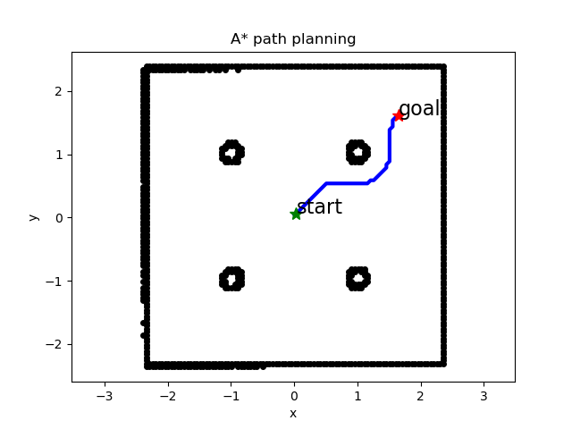
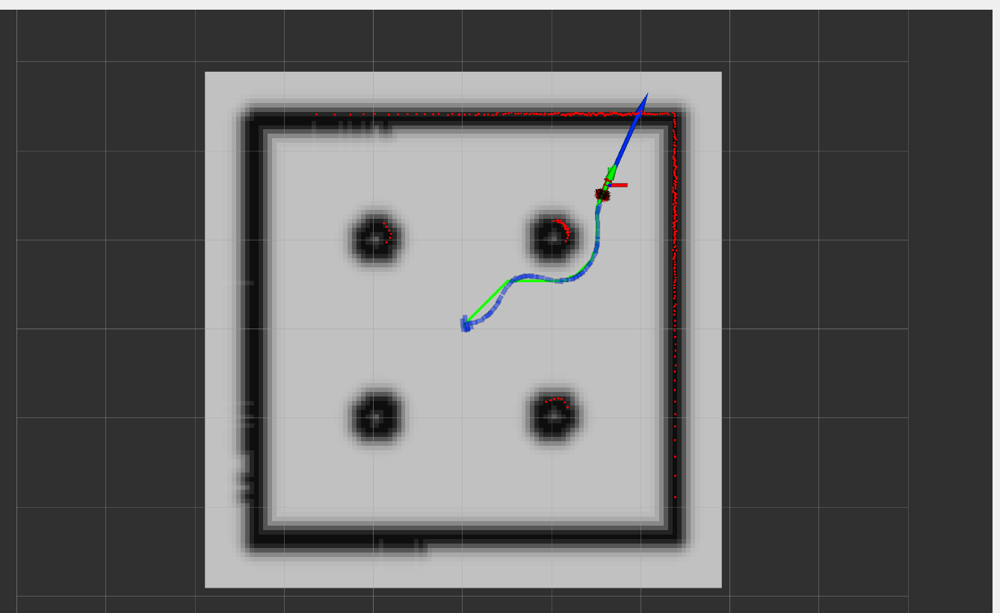

# Lab 4 — Path Planning and Autonomous Navigation

## Purpose

This module implements full autonomous navigation by integrating planning, localization, and control.

It enables the robot to:
- generate collision-free paths using A* search
- localize itself using a particle filter
- follow planned trajectories using closed-loop control
- execute goal-directed navigation in a mapped environment

## Implemented Functionality

- Implemented A* path planning on occupancy grid maps
- Constructed cost maps from SLAM-generated environments
- Implemented Manhattan and Euclidean heuristics for path optimization
- Generated waypoint-based trajectories from planned paths
- Integrated planner with particle filter localization and PID control
- Executed autonomous navigation from user-defined goals in RViz
- Logged robot trajectory and compared planned vs executed paths

## Key Files

- `a_star.py` — A* search implementation with heuristic options
- `planner.py` — converts map into cost map and generates waypoint trajectories
- `mapUtilities.py` — processes occupancy grid maps for planning
- `particleFilter.py` — provides real-time pose estimation
- `localization.py` — integrates particle filter into navigation loop
- `controller.py` — computes motion commands from tracking error
- `decisions.py` — orchestrates full pipeline (localization → planning → control)

## System Integration

This module combines all previous components into a complete navigation pipeline:

Localization → Planning → Control → Execution

- Particle filter provides robot pose
- A* planner computes optimal path to goal
- Controller tracks path using velocity commands
- Robot executes motion in real time

## Results

- Successfully generated collision-free paths in mapped environments
- Executed autonomous navigation to multiple goal positions
- Compared Manhattan vs Euclidean heuristics for path efficiency
- Observed close alignment between planned and executed trajectories

## Role in Full Stack

This module represents the final integration of the robotics system, enabling full autonomous navigation.

It demonstrates the complete pipeline from perception and state estimation to planning and control, forming a deployable mobile robotics solution.
